 

 

## Hi there, I'm Giuliano Di Lorenzo 👋

I'm a passionate **Software Engineer** with a background in **Computer Science** and **Business Administration** from the **University of Florida**. I enjoy working on **innovative solutions** that blend **technology and creativity**, from **full-stack web development** to **AI-driven applications**. I'm always looking for opportunities to collaborate, learn, and build something impactful.

Just wrapped a **Software Engineering internship at Bank of America** (Global Technology, Summer 2026). Now pursuing an **M.S. in Information Systems, AI Specialization, at FIU** (Class of 2027), and in the pipeline for the **BofA Global Technology Summer Analyst 2027** role.

---

### 🛠️ Languages & Tools

<table align="center">
<tr>
<td align="center" valign="top">

**Programming**

Python C++ Java JavaScript TypeScript SQL PHP HTML/CSS

</td>
<td align="center" valign="top">

**Frameworks & Tech**

React Next.js React Native Node.js Express.js FastAPI REST APIs Tailwind CSS

</td>
<td align="center" valign="top">

**Cloud & Data**

AWS Lambda AWS EC2 Docker MongoDB Atlas Supabase MariaDB Vercel · Render · Cloudinary

</td>
<td align="center" valign="top">

**Software & Tools**

Git · GitHub Figma VS Code PyCharm · CLion Jira Agile / Scrum

</td>
</tr>
</table>

---

### 🚀 Featured Projects

- **🏦 [AI Automation Platform](https://github.com/giulivno) — Bank of America, Software Engineer Intern:** Built an AI automation platform that converted manual spreadsheet workflows into automated processes, cutting manual effort by 90%+. Developed a multi-agent system for AI-driven document analysis, and data-matching engines that reconciled information across sources into audit-ready outputs. Built with **Copilot Studio, Power Automate, Office Scripts, SharePoint, TypeScript**. *(Internal project — code not public.)*

- **🎵 [ChordMonkey – Music Theory-Powered Songwriting Assistant](https://github.com/giulivno/ChordMonkey):** Led frontend development and UX integration for a full-stack songwriting tool with authentication, song management, and a community discovery feed. Integrated ML audio pipelines using FastAPI and Spotify's Basic Pitch model for live audio-to-MIDI transcription. Built using **Next.js, React, TypeScript, FastAPI, Supabase, AWS Lambda, and Docker**.

- **📍 [GeoSpot – A Geolocation-Based Social App](https://github.com/Kafaldu/GeoSpot):** Led as **Scrum Master** for a 4-member team building a mobile app that encourages real-world exploration through geolocation challenges, boosting prototype engagement by 35% with 99% uptime. Built with **React Native, Node.js, Express, MongoDB, and Cloudinary**.

- **🏫 [CampusSwap – Student Marketplace Platform](https://github.com/giulivno/CampusSwap):** Led frontend development and UX for a full-stack student marketplace platform built with a **LAMP stack**, featuring student verification, image uploads, messaging, and Google Maps integration.

- **📊 [Recipe Finder Web App](https://github.com/giulivno/RecipeResource):** A React-based web app that helps students find recipes based on the ingredients they have at home, designed with usability and accessibility in mind.

- **🌐 [World Trade Amusement](https://worldtradeamusement.net/):** Designed and deployed a full-stack business website for an arcade game company, boosting mobile usability by 60%, site traffic by 40%, and reducing bounce rate by 30% within the first month. Built with **HTML5, CSS, Node.js, Express, and AWS EC2**.

- **🕹️ [Shortest Route Graph](https://github.com/JonathanHooth/Shortest-Path-Graph-Traversal):** Implemented **BFS, DFS, and Dijkstra's algorithm** in C++ to find the shortest path in a large-scale graph visualization project using **BRIDGES**.

---

### 🐍 Contribution Snake

---

### 📫 How to Reach Me

- **LinkedIn:** [linkedin.com/in/giuliano-di-lorenzo](https://www.linkedin.com/in/giuliano-di-lorenzo)
- **Email:** gdilorenzo@ufl.edu
- **GitHub:** [github.com/giulivno](https://github.com/giulivno)

---

### ⚡ Fun Fact

I've been playing on the same **Minecraft survival world** for the last **8 years** ⛏️🌍 Currently working on expanding my mountain kingdom!

*Let's connect and create something amazing together!* 🚀

